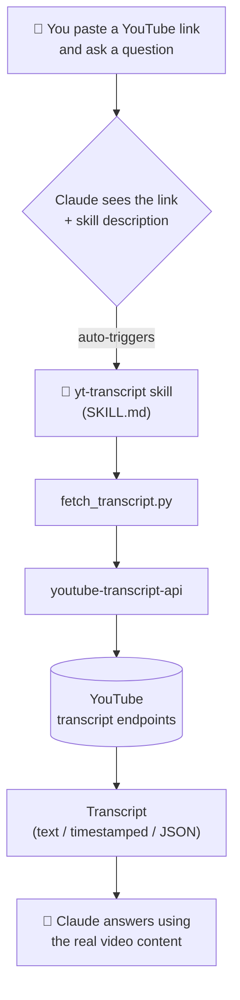
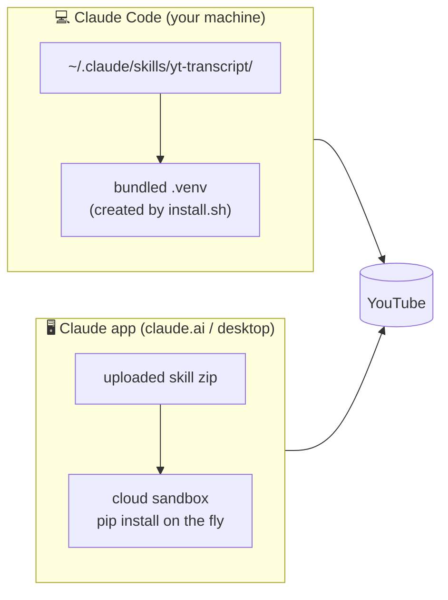

# YouTube Transcripts for Claude

A [Claude skill](https://docs.claude.com/en/docs/claude-code/skills) that automatically fetches YouTube video transcripts. Paste a YouTube link into Claude and ask for a summary, key points, or anything else — Claude pulls the real transcript via [`youtube-transcript-api`](https://github.com/jdepoix/youtube-transcript-api) and works from the actual video content instead of guessing or failing on a blocked page fetch.

```
You:    Summarize https://www.youtube.com/watch?v=dQw4w9WgXcQ
Claude: [fetches the transcript automatically, then summarizes it]
```

> **⚡ Install in under 2 minutes — pick your platform:**
>
> | Where do you use Claude? | Go to |
> |---|---|
> | 💻 **Claude Code** (CLI, VS Code / JetBrains, Claude Code desktop) | [→ Install for Claude Code](#-install-for-claude-code) |
> | 🖥️ **Claude app** (claude.ai website or Claude desktop app) | [→ Install for the Claude app](#%EF%B8%8F-install-for-the-claude-app-claudeai--desktop) |
>
> Install in **both** if you use both — they don't share skills.

---

## 💻 Install for Claude Code

Works for the `claude` CLI, the Claude Code desktop app, and the VS Code / JetBrains extensions. Requires Python 3.8+.

**1. Clone this repo:**

```bash
git clone https://github.com/prat3ik/youtube-transcripts-for-claude.git
cd youtube-transcripts-for-claude
```

**2. Run the installer:**

```bash
./install.sh
```

This copies the skill to `~/.claude/skills/yt-transcript/`, creates a private virtualenv inside it, and installs `youtube-transcript-api` — nothing touches your system Python.

**3. Use it.** Open any Claude Code session, paste a YouTube link, and ask:

```
Summarize https://www.youtube.com/watch?v=dQw4w9WgXcQ
```

The skill triggers automatically — no command to remember. (To invoke it explicitly, use `/yt-transcript <url>`.)

> **Windows note:** `install.sh` needs a bash shell (Git Bash or WSL). Or install manually: copy `skill/yt-transcript/` to `%USERPROFILE%\.claude\skills\yt-transcript\` and run `pip install youtube-transcript-api`.

---

## 🖥️ Install for the Claude app (claude.ai / desktop)

The claude.ai website and the Claude desktop app run skills in a cloud sandbox, so installation is a one-time zip upload — no Python needed on your machine.

**1. Download the skill zip** — grab [`yt-transcript-skill.zip` from the latest release](https://github.com/prat3ik/youtube-transcripts-for-claude/releases/latest), or build it yourself:

```bash
cd skill && zip -r yt-transcript-skill.zip yt-transcript
```

**2. Upload it to your Claude account:**

1. Open **[claude.ai → Settings → Capabilities](https://claude.ai/settings/capabilities)** (same place for the desktop app)
2. Make sure **Code execution & file creation** is toggled **ON** — skills run inside it; without it the skill can never trigger
3. Scroll to **Skills** → click **Upload skill**
4. Select `yt-transcript-skill.zip`
5. Confirm the skill appears in your list as **yt-transcript** and is enabled

**3. Use it.** In any new chat, paste a YouTube link and ask for a summary. Claude installs the transcript library in its sandbox on the fly and fetches the transcript.

> **Note:** YouTube sometimes rate-limits requests from datacenter IPs, so the cloud version may occasionally get blocked where the local Claude Code version succeeds. If Claude falls back to web search instead of using the skill, double-check step 2.2 (code execution enabled) and that the skill shows as enabled.

---

## How it works



The skill's `SKILL.md` description tells Claude when to activate: any message containing a YouTube URL (watch, `youtu.be`, Shorts, embed, live) or a bare video ID whose content needs transcribing, summarizing, or analyzing. Claude then runs the bundled `fetch_transcript.py`, which extracts the video ID, fetches the best-matching transcript, and returns it in the requested format.

### Which install path runs what



## Usage examples

- `Summarize https://youtu.be/VIDEO_ID`
- `What are the key takeaways from this talk? https://www.youtube.com/watch?v=VIDEO_ID`
- `Get the transcript of this video with timestamps: <url>`
- `Translate the main points of <url> into Hindi`

You can also run the fetcher directly:

```bash
~/.claude/skills/yt-transcript/.venv/bin/python \
  ~/.claude/skills/yt-transcript/fetch_transcript.py \
  "https://www.youtube.com/watch?v=dQw4w9WgXcQ" --format timestamped
```

### CLI options

| Option | Values | Description |
|---|---|---|
| `--format` | `text` (default), `timestamped`, `json` | Output format |
| `--lang` | Any language code, e.g. `en`, `hi`, `es` | Preferred transcript language; falls back automatically |

## Features

- **Automatic triggering** — no command to remember; any YouTube URL activates the skill
- **Three output formats** — plain text for summaries, `[MM:SS]` timestamps for referencing moments, JSON for programmatic use
- **Language support** — request any language, with automatic fallback to English or whatever is available
- **No API key required** — uses YouTube's public transcript endpoints
- **Self-contained** — the local install lives entirely in one folder with its own virtualenv

## Troubleshooting

| Problem | Fix |
|---|---|
| Skill doesn't trigger in Claude Code | Check `~/.claude/skills/yt-transcript/SKILL.md` exists, then restart Claude Code |
| Skill doesn't trigger on claude.ai | Settings → Capabilities: enable **Code execution**, confirm the skill is uploaded and enabled |
| `transcripts are disabled` | The channel turned off captions — no transcript exists for that video |
| `no transcript found` | The video has no captions in any language |
| `RequestBlocked` / network errors | YouTube is rate-limiting your IP (common on cloud/VPN) — wait and retry |
| Import errors locally | Re-run `./install.sh` to rebuild the virtualenv |

## Credits

- Transcript fetching by [jdepoix/youtube-transcript-api](https://github.com/jdepoix/youtube-transcript-api) (MIT).

## License

[MIT](LICENSE)
